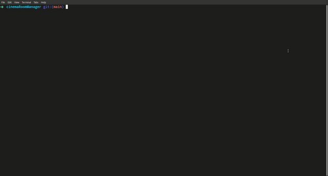

# Cinema room manager

Aplicacion que revervar boletos de un cine o teatro, indica en patalla los asiento libres y ocupado en el menu de opciones, como los precios de las ventas de los asientos vendidos.

## Usage
La aplicación al ejecutar el programa debera de ingreasar el numero de filas y asientos de su cine, despues la aplicacion tendra un menu interactivo que lo estará guiando en la aplicación.
~~~
java cinema.Cinema
~~~

## Compilation
~~~
javac cinema/Cinema.java
~~~
